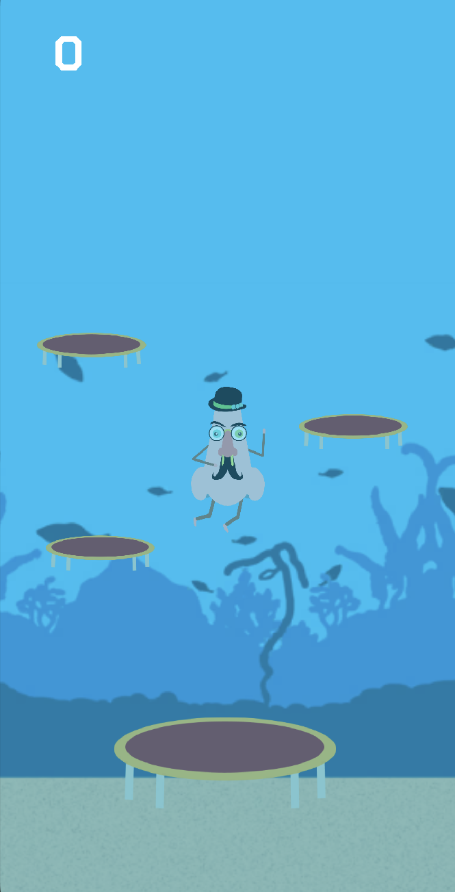
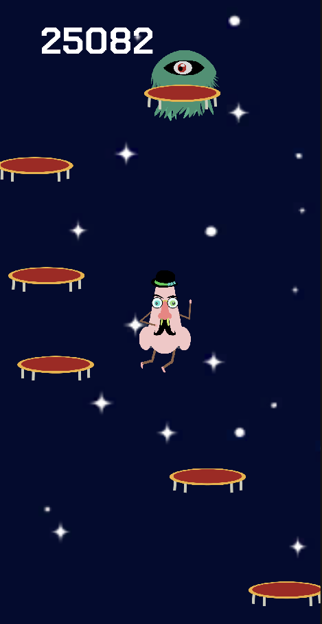

# Nosense

Nosense is an endless runner game developed for educational purposes by me and Emanuele De Rogatis. In this whimsical game, a nose must jump on trampolines and ascend higher and higher. The ultimate goal is to reach deep space and beyond, accumulating as many points as possible.

- [Description](#description)
- [Features](#features)
- [Screenshots](#screenshots)
- [TestFlight](#testflight)
- [License](#license)

## Description

Nosense is a fun and addictive endless runner where players control a nose that must continuously jump on trampolines to avoid falling. The challenge increases as the nose ascends, aiming to reach space and gather maximum points. Emanuele De Rogatis contributed significantly to the project by creating the game assets.

## Features

- Endless gameplay with increasing difficulty.
- Unique character: a nose that jumps on trampolines.
- Engaging graphics and animations.
- High score tracking.

## Screenshots

## License

This project is licensed under the MIT License. See the LICENSE file for more details.

## TestFlight

[Clic Here !!!](https://testflight.apple.com/join/rqMslbnZ)
